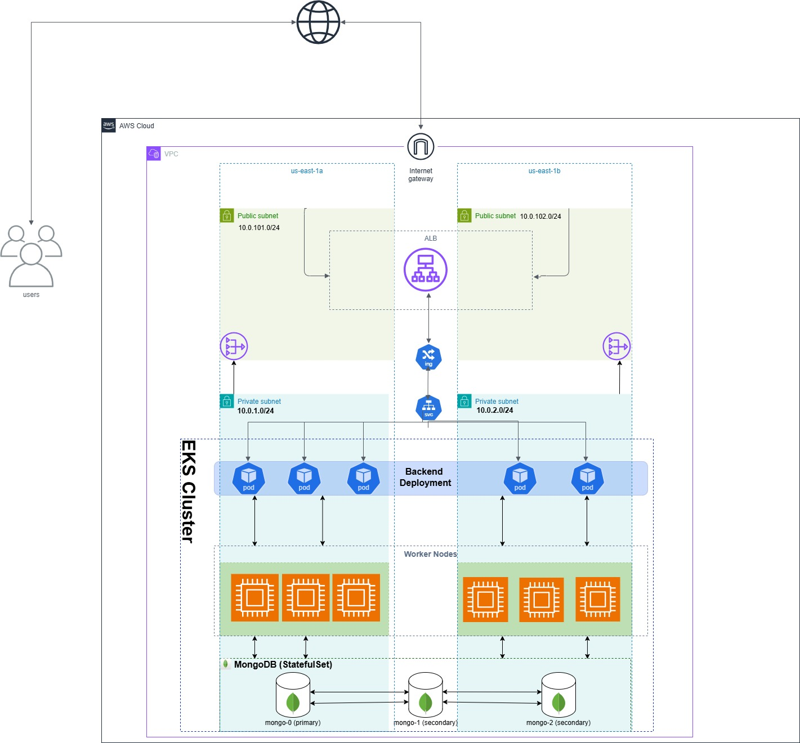

# AWS EKS CRUD API with MongoDB Replica Set

A cloud-native backend application deployed on Amazon EKS using Kubernetes, MongoDB StatefulSet, Horizontal Pod Autoscaler (HPA), AWS ALB Ingress Controller, and Terraform infrastructure provisioning.

---

# Project Overview

This project demonstrates a production-style Kubernetes deployment on AWS using:

* Amazon EKS
* Terraform Infrastructure as Code
* MongoDB Replica Set with StatefulSet
* Persistent Storage using AWS EBS
* Node.js CRUD API
* Kubernetes Ingress with AWS ALB
* Horizontal Pod Autoscaling
* High Availability and Self-Healing

---

# Architecture



---

# Architecture Flow

```text
Users
   ↓
Internet
   ↓
Internet Gateway (IGW)
   ↓
Application Load Balancer (Public Subnets)
   ↓
Ingress
   ↓
ClusterIP Service
   ↓
Backend Pods
   ↓
MongoDB Replica Set
```

---

# AWS Infrastructure

## VPC

```text
10.0.0.0/16
```

## Public Subnets

```text
10.0.1.0/24
10.0.2.0/24
```

Used for:

* Application Load Balancer
* Internet-facing traffic

## Private Subnets

```text
10.0.101.0/24
10.0.102.0/24
```

Used for:

* EKS Worker Nodes
* Backend Pods
* MongoDB StatefulSet

---

# Technologies Used

| Technology  | Purpose                       |
| ----------- | ----------------------------- |
| AWS EKS     | Kubernetes Cluster            |
| Terraform   | Infrastructure Provisioning   |
| Docker      | Containerization              |
| Kubernetes  | Container Orchestration       |
| MongoDB     | Database                      |
| StatefulSet | Persistent MongoDB Deployment |
| AWS EBS     | Persistent Storage            |
| HPA         | Auto Scaling                  |
| ALB Ingress | External Access               |
| Node.js     | Backend API                   |
| Express.js  | REST API                      |

---

# MongoDB Architecture

MongoDB is deployed as a Replica Set using StatefulSet.

## Replica Set Members

```text
mongo-0 → PRIMARY
mongo-1 → SECONDARY
mongo-2 → SECONDARY
```

## Features

* Persistent Storage using EBS
* Stable Network Identity
* Automatic Pod Recreation
* High Availability
* Data Replication

---

# Horizontal Pod Autoscaler

The backend deployment scales automatically based on CPU utilization.

## HPA Configuration

```text
Min Replicas: 1
Max Replicas: 5
Target CPU: 70%
```

---

# Backend API Endpoints

## Create dataset

```http
POST /posts
```

Example:

```json
{
  "title": "Test",
  "content": "Hello from EKS"
}
```

---

## Get All datasets

```http
GET /posts
```

---

## Update dataset

```http
PUT /posts/:id
```

---

## Delete dataset

```http
DELETE /posts/:id
```

---

# Deploy Infrastructure

## Initialize Terraform

```bash
terraform init
```

## Apply Infrastructure

```bash
terraform apply -auto-approve
```

---

# Build Docker Image

```bash
docker build -t your-dockerhub-username/backend:v1 .
```

---

# Push Docker Image

```bash
docker push your-dockerhub-username/backend:v1
```

---

# Deploy Kubernetes Resources

```bash
kubectl apply -f mongo.yaml
kubectl apply -f backend.yaml
kubectl apply -f ingress.yaml
kubectl apply -f hpa.yaml
```

---

# Verify Resources

## Check Pods

```bash
kubectl get pods
```

## Check Services

```bash
kubectl get svc
```

## Check Ingress

```bash
kubectl get ingress
```

## Check HPA

```bash
kubectl get hpa
```

---

# Autoscaling Test
My ALB_DNS = k8s-default-backendi-4004ae3b3b-298464302.us-east-1.elb.amazonaws.com
Generate load using:

```bash
while true; do
  hey -n 1000 -c 50 http://ALB_DNS/posts
  sleep 2
done
```

Watch scaling:

```bash
watch -n 1 kubectl get pods -l app=backend
```

---

# High Availability Test

## Backend Self-Healing

```bash
kubectl delete pod <backend-pod>
```

Kubernetes automatically recreates the pod.

---

## MongoDB Self-Healing

```bash
kubectl delete pod mongo-1
```

StatefulSet recreates the pod while preserving data using EBS volumes.

---

# Project Structure

```text
Units_Task/
├── backend/
│   ├── Dockerfile
│   ├── package.json
│   └── server.js
│
├── infra/
│   ├── main.tf
│   ├── variables.tf
│   └── outputs.tf
│
├── k8s/
│   ├── mongo.yaml
│   ├── backend.yaml
│   ├── ingress.yaml
│   └── hpa.yaml
│
├── images/
│   └── architecture.png
│
├── README.md
└── .gitignore
```

---

# Key Features

* Multi-AZ Deployment
* Kubernetes Self-Healing
* Horizontal Auto Scaling
* Persistent Storage
* MongoDB Replica Set
* Infrastructure as Code
* Production-Style Networking
* ALB Ingress Routing

---

# Future Improvements

* HTTPS with ACM
* Monitoring using Prometheus & Grafana
* CI/CD Pipeline using GitHub Actions
* ArgoCD GitOps Deployment
* Helm Charts
* Secrets Management

---
